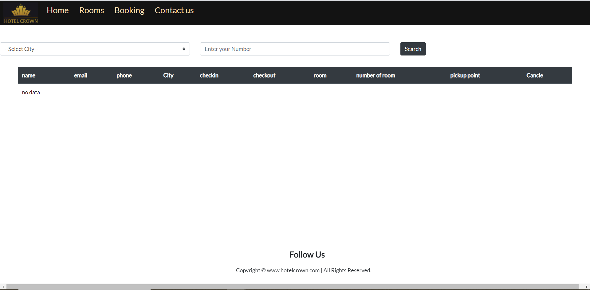

# Hotel-booking-system
A web application to book a room in a hotel, a customer must check the application to see, the duration of the reservation and the overall cost ..etc. by introducing personal information.

## Features

- Book Room
- Download Recipt
- Cancle Booking
- facilities
- contact us

## Software Requirements

- Node.js
- MongoDB

## How to install

### Using manual download ZIP

1.  Download repository
2.  Uncompress to your desired directory

### Install npm dependencies after installing (Git or manual download)

bash
npm install

## How to run

### Running API server locally

bash
node app.js

If you have nodemon package then,

bash
nodemon app.js

You will know server is running by checking the output of the command `node app.js`

# Screenshot
## Home Page

## Room Page

## Gallery

## Booking

## Cancle Booking

## Download Recipt

## contact us

